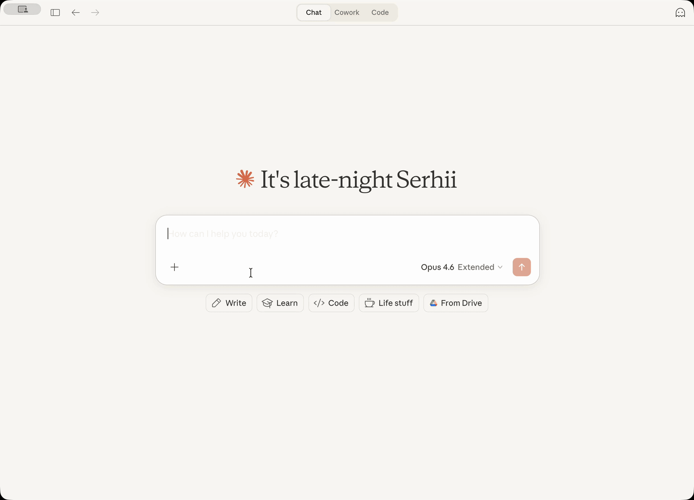

[](https://github.com/vasylenko/claude-desktop-extension-bear-notes/actions/workflows/ci.yml)
[](https://snyk.io/test/github/vasylenko/claude-desktop-extension-bear-notes)
[](https://mseep.ai/app/34d7b12a-3983-40a3-876f-3cdd2ccfe3f2)
    
# Bear Notes Claude Extension (aka MCP Bundle)

Search, read, create, and update your Bear Notes directly from Claude conversations.

This **local-only** extension reads Bear's SQLite database for fast search with OCR support, and uses Bear's native API for writes. Complete privacy: no external connections, all processing on your Mac.

Example prompts:

> Find my Bear notes about the last trip to Norway

> Go through my untagged notes and suggest how to tag them 

> Summarize our conversation and create a new Bear note with it



## Staying Up To Date

Consider to subscribe to release announcements to know when I release a new version of the extenstion:


I also post to [reddit.com/r/bearapp/](https://www.reddit.com/r/bearapp/) when there's a new release.

## Tools

- **`bear-search-notes`** - Find notes by text content or tags, returns list with IDs for further actions
- **`bear-open-note`** - Read full content of a specific note including text, formatting, and metadata
- **`bear-create-note`** - Create new notes with optional title, content, and tags
- **`bear-add-text-append`** - Add text to the end of existing notes or specific sections
- **`bear-add-text-prepend`** - Insert text at the beginning of existing notes or sections
- **`bear-add-file`** - Attach files (images, PDFs, spreadsheets, etc.) to existing notes

## Claude Desktop Extension Installation

**Prerequisites**: [Bear app](https://bear.app/) must be installed and [Claude Desktop](https://claude.ai/download) must be installed.

1. Download the latest `bear-notes-mcpb.mcpb` extension from releases
2. Make sure your Claude Desktop is running (start if not)
3. Doubleclick on the extension file – Claude Desktop should show you the installation prompt

    If doubleclick does not work for some reason, then open Claude -> Settings -> Extensions -> Advanced Settings -> click "Install Extension".

4. DONE!

Ask Claude to search your Bear notes with a query like "Search my Bear notes for 'meeting'" - you should see your notes appear in the response!

## Standalone MCP Server Installation

Want to use this Bear Notes MCP server with Claude Code, Cursor, Codex, or other AI assistants?

You can run it as a standalone MCP server.

**Requirements**: Node.js 22.13.0+

### Quick Start - Claude Code (One Command)

**For Node.js 22.13.0+ / 23.4.0+ / 24.x+ / 25.x+ (recommended):**
```bash
claude mcp add bear-notes --transport stdio -- npx -y bear-notes-mcp@latest
```

That's it! The server will be downloaded from npm and configured automatically.

**More standalone MCP server installation guides here -- [NPM.md](./docs/NPM.md)**

## Technical Details

This server reads your Bear Notes SQLite database directly for search/read operations and uses Bear's X-callback-URL API for write operations. All data processing happens locally on your machine with no external network calls.

### Platforms Supported
macOS only because Bear desktop works only on macOS.

### Logs
- MCP server logs go into `~/Library/Logs/Claude/main.log`, look for `bear-notes-mcp`
- MCP transport logs go to `~/Library/Logs/Claude/mcp-server-Bear\ Notes.log` 

## FAQ

### Could this steal my data?
**No**. Extension only reads Bear's local database (same data Bear app shows you) and uses Bear's application native API to add text to the notes. No network transmission, no external servers.

### Why SQLite and not just a native Bear app's x-callback-url API?

For read operations (search/open), the x-callback-url API returns the note data in `x-success` response: that would require a server or custom binary to handle x-success responses - both risky and fragile. Direct SQLite read-only access is simpler and more reliable for searching and reading notes.

### Why experimental flag for nodejs?

This is to enable native SQLite support and avoid shipping an SQLite binary from third-party node packages, which poses supply chain risks and blocks the Claude extension from running on macOS.

Anthropic does not sign third-party SQLite binaries (obviously), causing macOS security systems to flag that the Claude process from a binary signed by Anthropic is trying to run another binary signed by a third party. As a result, Claude cannot run the extension. 

### When I install the extension, I see a red warning: "Installing will grant access to everything on your computer." - what does this mean?

This is how Claude for Desktop reacts to the fact that this extension needs access to the Bear SQLite databse on your Mac.

Claude warning system does not distinguish between the need to access only one file (what the extension does) versus the need to access all files (this is NOT what the extention does).

One of the ways to validate this is asking your Claude to analyze the codebase (it is pretty small) before installing the extension and tell you.

### How can I report a bug or contribute? 

Use issues or discussions! I'd be glad to see your feedback or suggestions, or your help to make this extension better! ❤️ 

[](https://mseep.ai/app/vasylenko-claude-desktop-extension-bear-notes)
